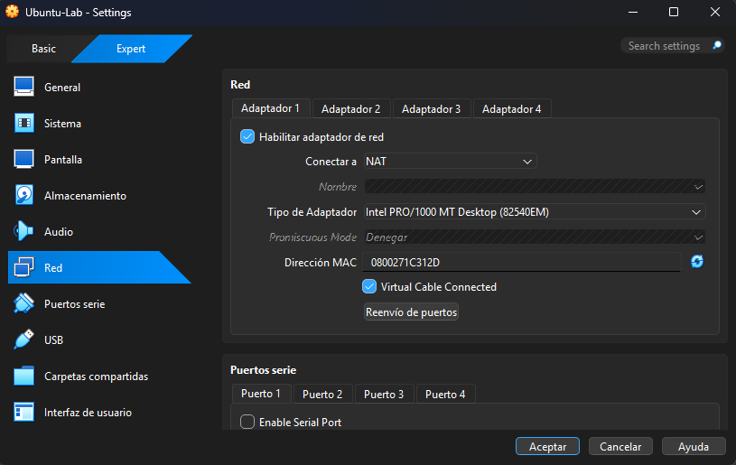
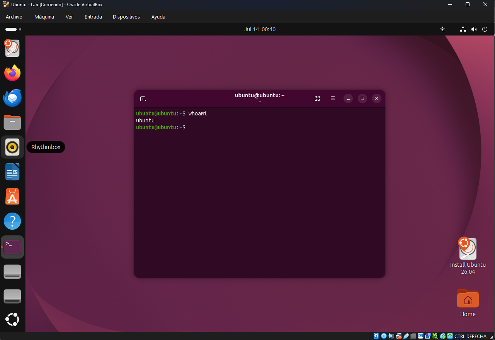
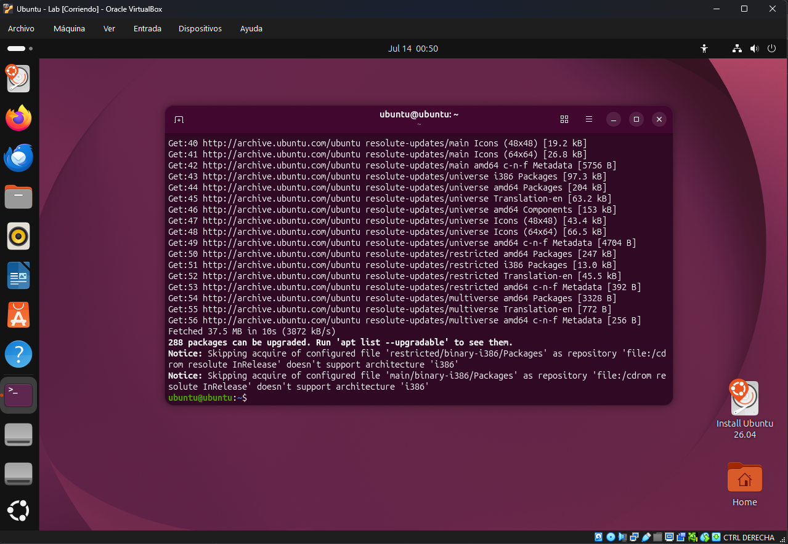
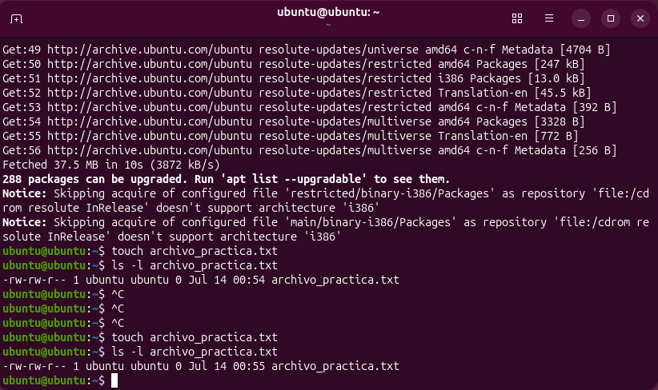
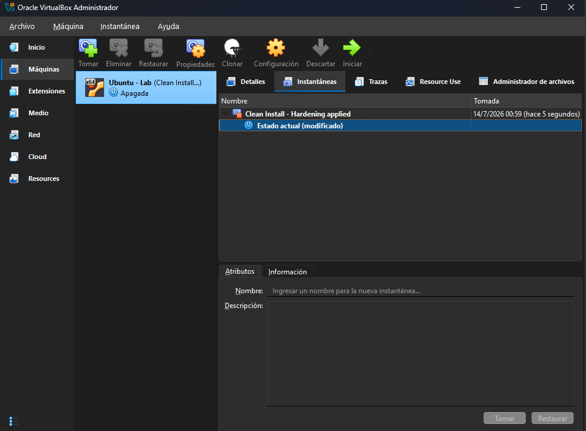

# Checkpoint: Mi primer laboratorio seguro de ciberseguridad

## 1. Red aislada
Se configuró la máquina virtual en modo NAT para reducir la exposición en la red local y proteger el host.

## 2. Usuario estándar y actualizaciones
Se utilizó un usuario sin privilegios elevados y se verificó que el sistema estuviera actualizado.

## 3. Permisos y gestión
Se revisaron permisos de archivos con `ls -l` y se buscaron actualizaciones de paquetes con `sudo apt update`.

## 4. Snapshot inicial
Se creó una instantánea inicial llamada `Clean Install - Hardening applied`.

Durante la ejecución del laboratorio, la instalación de Ubuntu en VirtualBox presentó fallas de arranque/carga que impidieron completar la generación de todas las evidencias solicitadas, siempre se congelaba al final del procedimiento. Se documentó la configuración de red en NAT y el estado del entorno como evidencia parcial del intento de implementación.

